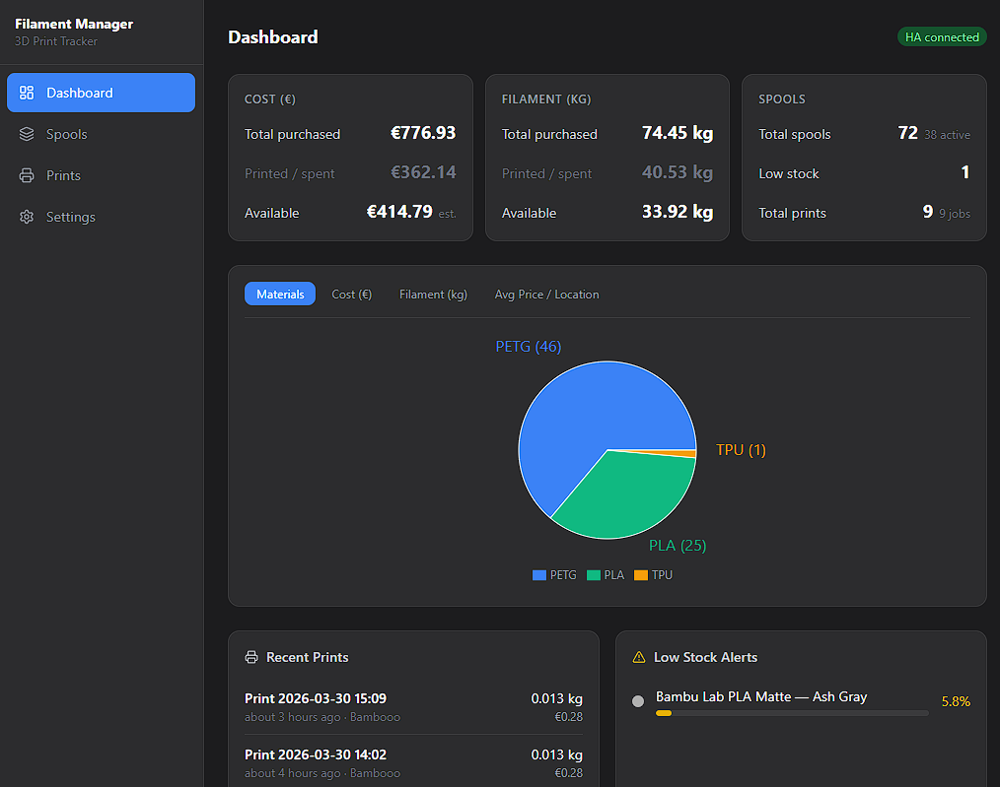
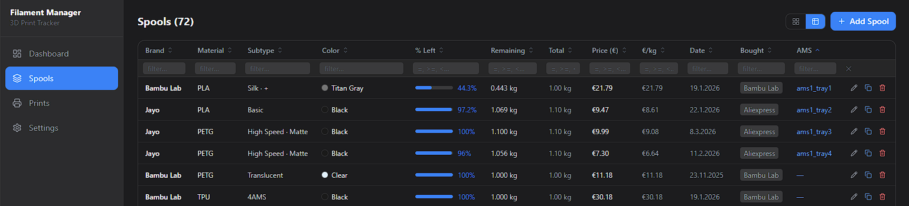
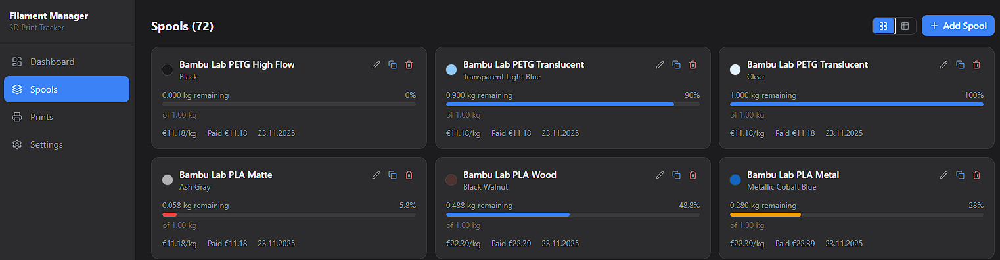
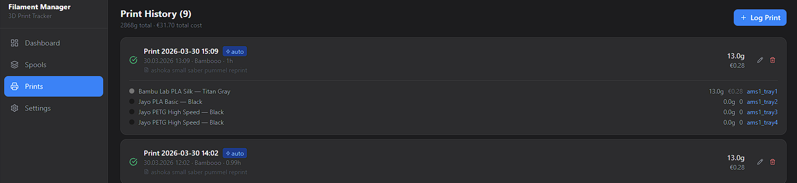
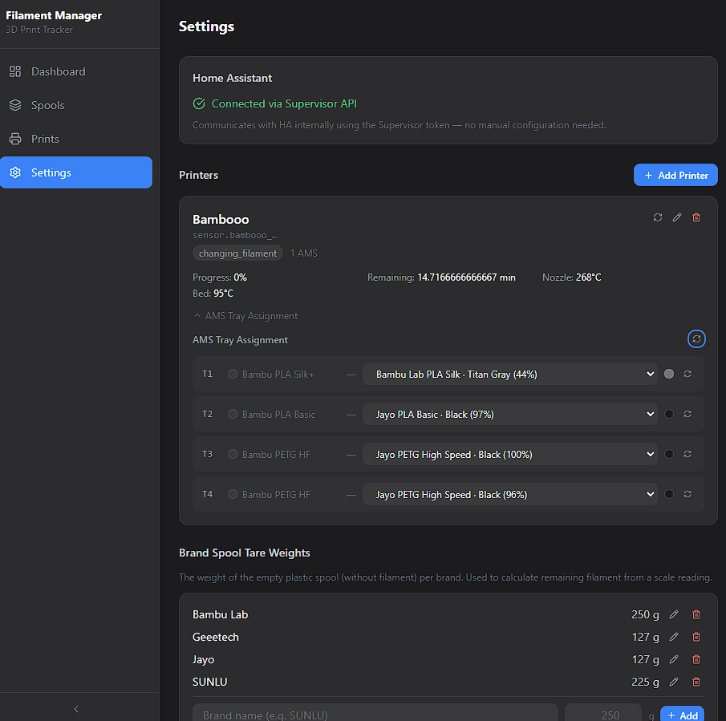

# Filament Manager

A Home Assistant app for tracking 3D printer filament inventory, monitoring print history, and calculating material costs. Integrates natively with Bambu Lab printers via the [greghesp Bambu Lab integration](https://github.com/greghesp/ha-bambulab).

 

---

## Features

- **Automatic print detection** — monitors your Bambu Lab printer state via HA sensors and creates print records automatically
- **AMS filament tracking** — snapshots filament levels at print start/end and calculates grams used per spool
- **Spool inventory** — full CRUD for filament spools with brand, material, color, weight, and cost data
- **Cost analytics** — per-print cost, price per kg, inventory value, and spend by purchase location
- **Dashboard** — overview charts, low-stock alerts, and recent print history
- **Printer discovery** — scans Home Assistant for your Bambu Lab entities automatically
- **EN / DE / ES interface** — full translations with in-app language switcher; inherits language from your HA instance by default
- **Data export / import** — back up and restore all spools, prints, and settings as a single JSON bundle
- **Spoolman export** *(experimental)* — export your spool inventory in [Spoolman](https://github.com/Donkie/Spoolman)-compatible format
- **Bambu Lab Cloud** *(experimental)* — direct MQTT connection to Bambu Lab Cloud for real-time print monitoring; HA integration and Cloud mode coexist per-printer
- **Custom sensor entity IDs** — per-printer overrides for all HA sensor entity IDs, for users whose HA installation is in a different language or with renamed entities
- **Print weight tracking** — total filament weight (g) per print job, fetched automatically from the Bambu Cloud task API (cloud printers) or the `print_weight` HA sensor (HA printers)

---

## Screenshots











---

## Requirements

- Home Assistant with Supervisor (HassOS / Home Assistant OS)
- [Bambu Lab integration by greghesp](https://github.com/greghesp/ha-bambulab) already configured


---

## Installation
Go to Settings -> Apps -> Install App ->
Click on the 3 dots in top right corner -> Repositories ->
Copy the url to this repo https://github.com/cgradl/filament-manager and paste it into the add box at the bottom -> Press the button "add" and close after wards.
Once the app shows up in your list click on it and press install


---

## Configuration (dont use cloud yet)
```
After installation go to Settings page
Click "+ Add Printer" 
a)if you use english and standard sensor names:
1st field put printer name as shown in HA under Settings → Devices & Services → Bambu Lab. (e.g. myprinter)
2nd field put printer name as shown in HA under Settings → Devices & Services → Bambu Lab. (e.g. myprinter)
press test
all values should be filled
press save
b) if you have other language or non standard sensor names for printer and AMS
1st field put printer name as shown in HA under Settings → Devices & Services → Bambu Lab. (e.g. myprinter)
2nd field put printer name as shown in HA under Settings → Devices & Services → Bambu Lab. (e.g. myprinter)
Click on Custom Sensor entity IDs
Fill all below fields with the right sensor name (e.g. sensor.myprinter_current_stage)
press save
```
---
## How It Works

### Automatic Print Tracking

A background job polls `sensor.{device_slug}_current_stage` every 30 seconds.

```
idle → printing         Creates a new PrintJob + captures AMS snapshot
printing → finished     Closes job, calculates filament delta, updates spool weights
printing → failed       Closes job with failed flag
```

### Filament Consumption Calculation

At print start, the app records the remaining percentage of each AMS tray. On print end, it computes:

```
grams_used = initial_weight_g × (pct_start − pct_end) / 100
```

The spool's `current_weight_g` is updated automatically.

### Cost Tracking

Each spool stores a purchase price. The app derives:

- `price_per_kg` = price ÷ net weight (kg)
- `cost_per_gram` = price_per_kg ÷ 1000
- Per-print cost = Σ (grams_used × cost_per_gram) across all spools used

---

## API Overview

| Resource | Endpoints |
|----------|-----------|
| Spools | `GET/POST /api/spools` · `GET/PATCH/DELETE /api/spools/{id}` |
| Prints | `GET/POST /api/prints` · `GET/PATCH/DELETE /api/prints/{id}` |
| Printers | `GET/POST /api/printers` · `GET /api/printers/discover/{slug}` |
| Dashboard | `GET /api/dashboard` |
| Settings | `GET /api/app-settings` · `GET /api/app-settings/ha-connected` |

Full interactive docs available at `http://<ha-host>:8099/docs` (FastAPI Swagger UI).

---

## Data & Persistence

- Database: SQLite at `/data/filament.db` (persists across app updates)
- Schema migrations run automatically on startup — no manual steps required
- Updating the app never touches the database

---


## Configuration

The app exposes no user-visible `config.yaml` options. All configuration is done inside the app's **Settings** page after first launch:

1. Verify **HA Connected** shows green
2. Click **Add Printer** and enter your device slug (e.g. `my_printer`)
3. Use the auto-discovery search to map your AMS tray entities
4. Add your filament spools under **Spools**

---

## License
MIT License (see license file). Not affiliated with Bambu Lab or Home Assistant.
---

## Makerworld profile
check out my 3d models under
https://makerworld.com/en/@carasak/
